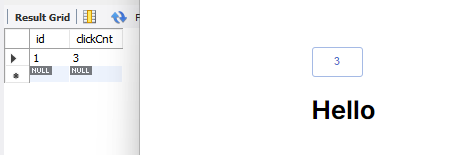
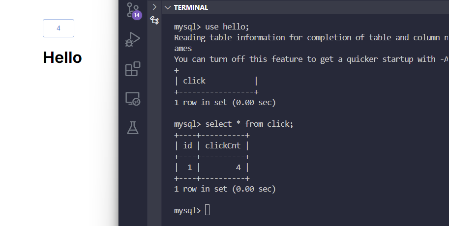

## 🛠 기능
- 버튼을 누르면 클릭 횟수가 버튼의 텍스트에 표시되고, DB에 저장되도록 했습니다.
- 처음 버튼을 누르면 하단에 "Hello" 글씨가 출력됩니다.
- Next.js, FastAPI, MySQL을 사용했습니다.

## 🚀 구현 화면 
### Local 

### Docker

## 🚨 관련 이슈
1. 도커 실행 시 hello 데이터베이스는 존재하지만 click 테이블이 존재하지 않는 에러 발생 → 'init.sql' 파일의 권한 문제
    - 해결 방법

          1. 파일 권한 확인
              ls -l init.sql

          2. 파일 권한 수정 (모든 사용자에게 읽기 권한을 부여)
              chmod 644 init.sql

2. 버튼 클릭 시 '500 Internal Server Error' 에러 발생
    - 해결 방법

          1. FastAPI의 database.py에서 DB_URL 수정
              mysql+mysqlconnector://root:1234@db:3306/hello

          2. Next.js의 next.config.mjs에서 destination 수정
              /** @type {import('next').NextConfig} */
              const nextConfig = {
                  reactStrictMode: true,
                  swcMinify: true,
                  async rewrites() {
                      return [
                          {
                              source: "/:path*",
                              destination: "http://fastapi:5000/:path*",
                          },
                      ];
                  },
              };
              
              
              export default nextConfig;

          3. docker-compose.yml의 fastapi 부분에 healthcheck 추가
              fastapi:
                build:
                  context: ./Final-back
                  dockerfile: ./Dockerfile
                ports:
                  - "5000:5000"
                depends_on:
                  - db
                environment:
                  - DATABASE_URL=mysql+mysqlconnector://root:1234@db:3306/hello
                networks:
                  - backend  
                healthcheck:
                  test: ["CMD", "curl", "-f", "http://db:3306"]
                  interval: 10s
                  timeout: 5s
                  retries: 5
